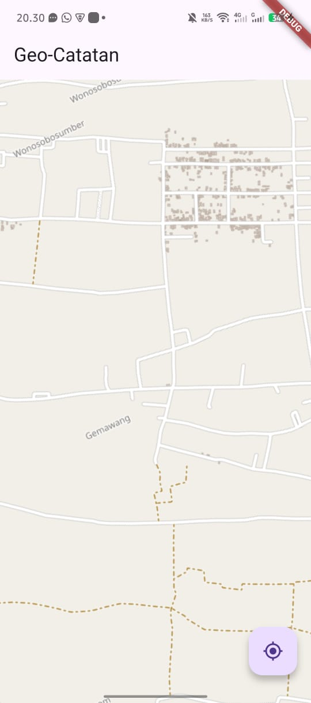
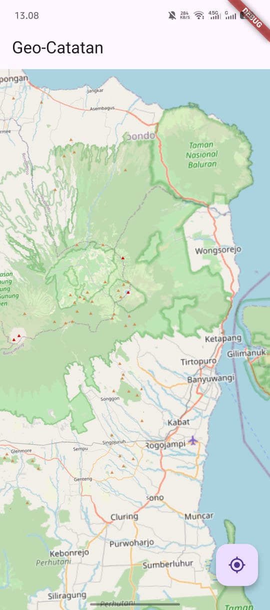
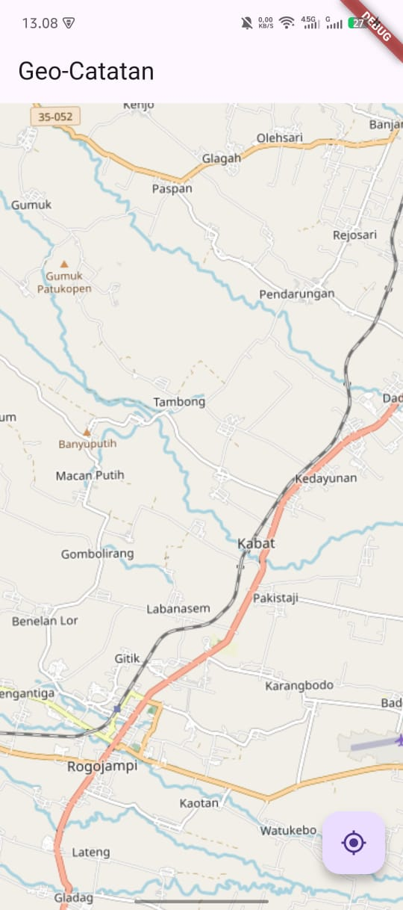
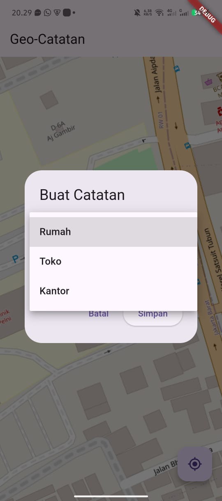
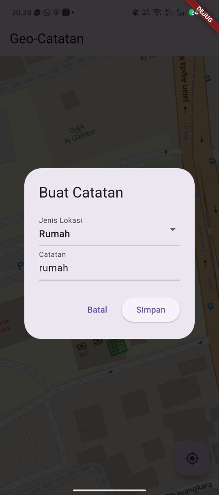
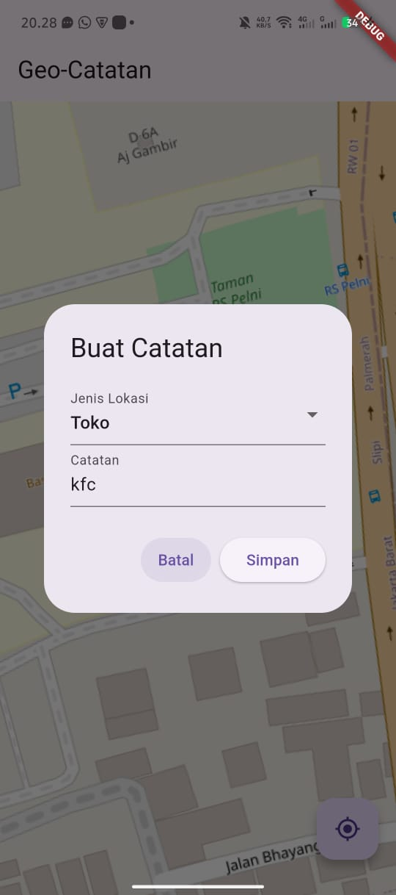
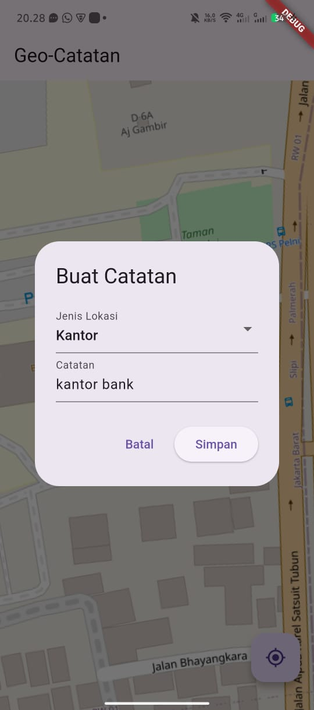
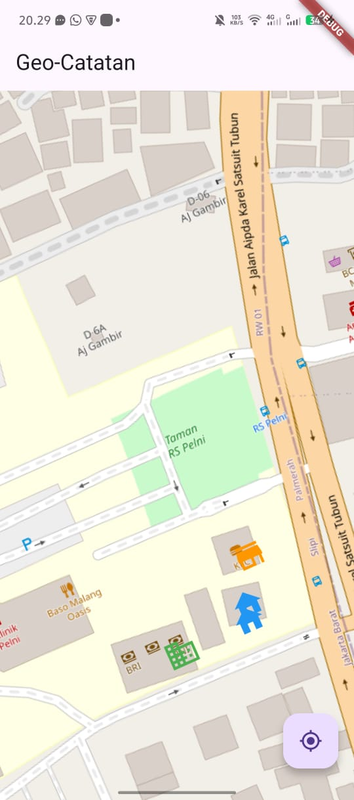

# praktikum_geo

A new Flutter project.

## Getting Started

This project is a starting point for a Flutter application.

A few resources to get you started if this is your first Flutter project:

- [Lab: Write your first Flutter app](https://docs.flutter.dev/get-started/codelab)
- [Cookbook: Useful Flutter samples](https://docs.flutter.dev/cookbook)

For help getting started with Flutter development, view the
[online documentation](https://docs.flutter.dev/), which offers tutorials,
samples, guidance on mobile development, and a full API reference.

Praktikum Geolokasi Flutter

Aplikasi Flutter yang menampilkan peta, lokasi pengguna, serta dapat menandai titik sebagai Rumah, Toko, atau Kantor. Titik tersebut disimpan menggunakan local storage sehingga tidak hilang saat aplikasi ditutup.

 Fitur Aplikasi

Menampilkan posisi pengguna di peta.

Menambahkan marker berdasarkan lokasi yang dipilih:
✔ Rumah
✔ Toko
✔ Kantor

Setiap marker memiliki:

Catatan (note)

Alamat

Jenis marker (Rumah/Toko/Kantor)

Marker disimpan ke storage agar tetap ada saat aplikasi dibuka ulang.

Hapus marker berdasarkan ID.

# LATIHAN PRAKTIKUM

# TUGAS PRAKTIKUM

